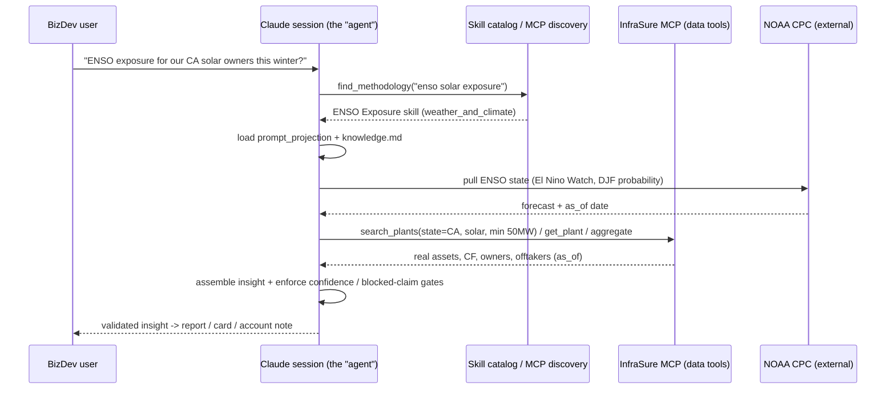

# 06 - Architecture

> **Status**: v0 target architecture, 2026-06-05.
>
> **Audience**: seniors deciding whether the design is sound; contributors building toward it; BizDev understanding how they will consume it.
>
> **In one line**: author **methodology skills** in this repo → **publish** them into an MCP-discoverable **skill catalog** → a BizDev user in Claude **searches a topic, loads the matching skill, and grounds it** with the InfraSure data tools + external sources to produce a **validated** report.

## 1. The Thesis

InfraSure already has a **data** surface (MCP tools over the substrate). What it lacks is a **reasoning** surface: packaged, discoverable methodology that tells a model how to reason about a topic, what to claim, and what to refuse. This architecture adds that second surface and connects the two.

```text
THE EXPANDABLE FLOOR — the MCP/served surface grows on two axes, not one:
   axis 1  DATA tools        search_plants · get_plant · aggregate · find_by_extracted_fact · …   (live today)
   axis 2  METHODOLOGY skills  el_nino_enso · (drought · wildfire · curtailment · offtaker-risk …)  (this layer)
```

A vanilla LLM can replicate neither curated axis. Serving both from one place — *here is the data, and here is how an InfraSure analyst reasons over it* — is the moat.

## 2. Core Principle: Repo Is Source, Not the Served Thing

You do **not** bolt the raw `weather_and_climate/` folder onto MCP. The repo is **source of truth**; a **publish step** compiles each resource package into a served unit. Two consequences:

```text
unit of delivery   = ONE SKILL  (el_nino_enso)        ← what a session loads (token-economical)
unit of discovery  = the TAXONOMY (domain·family·drivers·actors) ← how a session finds the right skill
domain folder      = source organization + discovery metadata, NOT a serving boundary
```

Loading one skill (not a whole domain) keeps context lean; skills **compose** at runtime (a "weather & climate analyst" session can load several). Persona = a runtime composition of skills, never a stored folder.

## 3. The Four Layers

```text
┌─ LAYER 0 · SOURCE OF TRUTH — the repo (insights_lab/, authored + versioned) ───────────────────┐
│  resources/<domain>/<skill>/      e.g.  weather_and_climate/el_nino_enso/                       │
│    ├ resource.yml        SPEC  → taxonomy(domain·family·drivers·actors) · confidence_rules ·    │
│    │                              blocked_claims      (drives discovery + gates + the prompt)   │
│    ├ prompt_projection.md METHOD → the instruction body the skill injects                       │
│    ├ knowledge.md         MECHANISM → cited domain reasoning                                     │
│    ├ resource.md          human canon · data_requirements.md  retrieval plan                    │
│    └ examples/ + test_runs/  EVAL SUITE → golden output + pass/fail cases                        │
└───────────────────────────────────────────┬───────────────────────────────────────────────────┘
                                   build / publish step
                                             ▼
┌─ LAYER 1 · SERVED SURFACE — what BizDev's Claude connects to ───────────────────────────────────┐
│  ┌ InfraSure MCP server ──────────────────────┐      ┌ Skill catalog ───────────────────────────┐│
│  │ DATA tools  search_plants · get_plant ·     │      │ one skill per resource package            ││
│  │             aggregate · plants_by_owner ·   │      │   "ENSO Exposure" (weather_and_climate)   ││
│  │             find_by_extracted_fact · news   │◀───▶ │   = prompt_projection + knowledge.md       ││
│  │ DISCOVERY   find_methodology(query|domain|  │      │   + eval examples                         ││
│  │             family) · get_methodology(slug) │      │ matched via resource.yml.taxonomy tags    ││
│  └─────────────────────────────────────────────┘      └───────────────────────────────────────────┘│
└───────────────────────────────────────────┬───────────────────────────────────────────────────┘
                                             ▼
┌─ LAYER 2 · RUNTIME — a BizDev analyst session (Claude Desktop / web / Code) ────────────────────┐
│  "ENSO exposure for our California solar owners this winter?"                                    │
│    1 discover  find_methodology("enso solar exposure") → ENSO skill                              │
│    2 load      inject prompt_projection + knowledge.md                                           │
│    3 ground    external NOAA pull (state)  +  InfraSure DATA tools (real assets)                 │
│    4 assemble  applied-insight contract (claim·scope·refs·confidence·caveats·actor)              │
│    5 gate      resource.yml confidence_rules + blocked_claims enforced (no $/MWh, cap LOW)       │
└───────────────────────────────────────────┬───────────────────────────────────────────────────┘
                                  validated insight object
                                             ▼
┌─ LAYER 3 · OUTPUT — the CONTENT ENGINE (renderings of a validated insight; see 08 P2) ───────────┐
│   validated insight object                                                                       │
│        │  render (audience × length) — NEVER a source of truth, only a projection of the insight │
│        ├─► BLOG / briefing            (the rich parent; many smaller renderings derive from it)  │
│        ├─► curated outreach email / account note                                                 │
│        ├─► platform card / Ask answer                                                            │
│        └─► LinkedIn / social post                                                                │
│   human-in-the-loop throughout — augment the analyst with more hands, never replace the judgment │
│                          (a rendering of a VALIDATED insight — never before it passes the gate)  │
└──────────────────────────────────────────────────────────────────────────────────────────────────┘
```

### Layer notes

- **Layer 0 — Source.** The repo. Authored, reviewed, version-controlled. The `resource.yml` is the spec that downstream everything reads.
- **Layer 1 — Served.** Two cooperating surfaces: the **MCP data tools** (already live) and a **skill catalog** (one skill per package). A small **discovery** capability (an MCP tool or a skill-catalog search) matches a user's topic to a skill via the taxonomy.
- **Layer 2 — Runtime.** A Claude session (the "agent") discovers → loads → grounds → assembles → gates. Grounding uses *both* the external state (NOAA) and the InfraSure substrate. **It is a loop, not a line** — a one-shot draft is rarely the product; the enrichment happens across turns, and the human checkpoint in that loop is the product, not overhead (`08_design_principles.md` P4):

```text
   discover → load → ground → assemble → GATE
                 ▲                          │
                 └──── human checkpoint ◀────┘
                    (enrich · re-scope · challenge · approve)
   the loop is "more hands, more dimension"; the eval suite must see the loop, not just the final draft
```

- **Layer 3 — Output.** The **content engine**: only a **validated** insight is rendered, into whatever audience/length the moment needs — blog or briefing (the rich parent), curated email / account note, platform card / Ask answer, social post. Every rendering is a *projection of the same validated insight object*, never a new source of truth, and never produced before the gate passes (`08` P2).

## 4. Request Lifecycle



> The sequence sketches the **single-skill-today** case; the authoritative `find_methodology` return is a ranked `SkillIndexRecord[]` the session confirms (top-N, never silent auto-bind) — full contract in `07_discovery_spec.md` §4.

## 5. Terminology — Package · Skill · Agent · Project · Tool

The pieces have distinct names and are easy to conflate — the v0 test docs say "load into a Claude **project**/session" while this doc says "**skill**," and they are NOT the same thing. The glossary:

| Term | What it is | In our stack |
|---|---|---|
| **Methodology resource / package** | the folder of SOURCE files we author (`resource.yml` · `knowledge.md` · `prompt_projection.md` · `resource.md` · `data_requirements.md` · `examples/` · `test_runs/`) | the **authoring** unit — lives in the repo at `resources/<domain>/<package>/` |
| **Skill** | the published, loadable capability **compiled from** a package — a **Claude Agent Skill**: a `SKILL.md` (`name` + `description` + body) plus bundled files, loaded on demand | the **served** unit: `package → publish → skill` |
| **Agent** | a running Claude session that has loaded a skill + the MCP tools | the BizDev session behaving as an "ENSO analyst" |
| **Claude Project** | a claude.ai workspace (custom instructions + attached files) | a v0 **manual-testing vehicle** (paste the projection in) — NOT the target delivery; the target is the discoverable Skill |
| **Tool** | a single callable function | the MCP data tools + `find_methodology` |

Don't confuse a *Claude Project* (a testing workspace) with **the InfraSure Insights project** (the whole initiative), nor a *skill* with the *package* it is built from.

**The relationship in one line — and it is the whole stack:**

```text
PACKAGE (source, many files) ──publish──▶ SKILL (served: SKILL.md + bundled files)
   ▲ authoring unit                              │ loaded by a session = AGENT, which calls TOOLS
   └ we author this                              └ this is what BizDev's Claude discovers + runs
```

**How the count grows:** one skill = one package = a small **fixed** set of files (each a different job, §6). The catalog grows by **more packages** (drought, wildfire, curtailment…), *not* by fatter packages.

**Naming:** a package/slug is snake_case (`el_nino_enso`); the published Skill `name` is its kebab-case form (`el-nino-enso`) per the Claude Skill spec (lowercase + hyphens, ≤64 chars). Discovery matches on the Skill **`description`**, so that field must say *what it does and when to use it*.

**Format vs delivery** (different axes — do not conflate): a package is *authored* in the Agent-Skill **format** (`SKILL.md` + bundled files). How it is *delivered* is a separate choice (§13 #1): **v0 serves** it via the InfraSure MCP — `get_methodology` returns the body as tool output, so `find_methodology` is the authoritative discovery path. *Installing* it as a **native** Agent Skill (where the model auto-selects by `description`) is a valid alternative — but then `find_methodology` is only a catalog aid, and the two are **not combined**. Same format either way.

## 6. Artifact Roles (which file feeds what)

```text
SERVED to the model (the skill payload)          AUTHORED for humans / validation
  resource.yml       spec · taxonomy · gates       resource.md          human canon
  prompt_projection  the method instruction body    data_requirements    retrieval plan / gaps
  knowledge.md       cited mechanism                 examples/+test_runs  EVAL SUITE (golden + pass/fail)
```

`resource.yml` is load-bearing — one file drives **three** things: **discovery** (taxonomy/tags), **the served prompt** (which sections to inject), and **the validation gates** (`confidence_rules` + `blocked_claims`).

## 7. Delivery Model

```text
METHODOLOGY (how to reason)  → SKILL.md-format packages, SERVED via the InfraSure MCP (get_methodology
                               returns the body)  [v0]   ·   or INSTALLED as native Agent Skills [alt]
DATA        (what is true)    → MCP tools               (live today)
DISCOVERY   (find the skill)  → MCP tool over the registry (resource.yml.taxonomy — mirrored in resources/README.md)
```

Mapping to platform primitives:

| Need | Mechanism (v0) | Notes |
|---|---|---|
| Reason like an analyst | method authored in `SKILL.md` format, **served** by `get_methodology` as tool output | `prompt_projection` ≈ the skill body; `knowledge.md` a bundled file fetched on demand |
| Find the right skill | **MCP Tool** `find_methodology` over the registry | the authoritative path in the served model (nothing else auto-selects) |
| Retrieve grounded data | **MCP Tools** | already implemented |
| *Alternative delivery* | **install** as native Claude Agent Skills | model auto-selects by `description`; then `find_methodology` is a catalog aid, not the loader — **not combined** with the served model |

Recommendation (v0): **author in `SKILL.md` format, serve via the InfraSure MCP** (`find_methodology` + `get_methodology`) alongside the data tools — one MCP, coherent discovery, matching the BizDev mental model ("search a topic → get a skill"). Native-Skill install is a valid alternative where the host supports it. Full contract: `07_discovery_spec.md`.

## 8. Discovery In Detail

```text
find_methodology(query | domain | family | actor)
   → ranks skills by taxonomy match (resource.yml.taxonomy: domain · family · drivers · actors)
   → returns {slug, title, domain, family, summary, confidence_default}
get_methodology(slug)
   → returns the skill payload (the compiled SKILL.md body + bundled knowledge.md / examples / data_requirements + version) — full shape in 07 §8

slug = resource.yml.identity.slug — the single get_methodology resolution key, and the
       source folder name MUST equal it (the publish step asserts this).
       Canonical today: folder == slug == el_nino_enso. (Resolved — see Open Decision 6.)
```

Example: `find_methodology("el nino solar exposure")` → returns the **ENSO Exposure** skill (slug `el_nino_enso`; domain `weather_and_climate`; family `exposure`; drivers `enso, irradiance`). This is why the taxonomy exists — it is the discovery index, not decoration.

In v0, methodology is **served via the InfraSure MCP**: `get_methodology` returns the SKILL.md-format body as tool output, so `find_methodology` is the authoritative discovery path (nothing else auto-selects). If instead the packages are *installed* as native Claude Agent Skills, the model auto-selects by `description` and `find_methodology` becomes a catalog aid — that delivery choice is §13 #1; *where* the discovery logic lives is §13 #2.

**Full contract** — input/output shapes, the ranking algorithm, edge cases, and the synonym map — is specified in `07_discovery_spec.md`.

## 9. Validation Gate

The **applied-insight thin contract** + `resource.yml` rules are the quality firewall before anything renders:

```text
confidence_rules   → cap confidence at the weakest input (ENSO default = LOW)
blocked_claims     → refuse exact LMP / plant-level forecasts / pre-validation outreach
examples/+test_runs → the EVAL SUITE: a skill must reproduce its golden output + pass its cases before publish
```

In production these become *enforced* gates and a *trace* attached to each insight object (the scope file's in-house track).

**Input-availability gate** (distinct from `blocked_claims`, which gate claim *type*): empty asset scope for the region ⇒ **BLOCKED** (scope unresolved); a failed/stale external (NOAA) pull ⇒ **BLOCKED** (state missing/stale); partial *optional* inputs ⇒ cap at **LOW**. These are the `resource.yml.confidence_rules.blocked` conditions applied at the tool-result layer. (Enforcing a freshness *window* on the NOAA pull is Open Decision 3.)

**v0 caveat — the gate is self-policing.** In v0 it is a *prompt-level convention* enforced by the **same** session that drafts the insight: the session that produced a blocked `$/MWh` figure is the one asked to refuse emitting it, with no independent validator. This is a known v0 weakness; production moves enforcement out of the drafting session.

## 10. Mapping To The Scope File

| Scope-file concept | Architecture home |
|---|---|
| validated insight object | Layer 2 output (the applied-insight contract) |
| in-house architecture track | the publish step + discovery + enforced gates + trace capture (Layer 0→1) |
| activation / outreach track | Layer 3 rendering (report / card / account note / email) |
| "outreach is a rendering, not the source" | the validation gate sits *between* insight and activation |

## 11. Build Status & Roadmap

| Capability | Status | Next |
|---|---|---|
| Data tools (MCP) | ✅ live | wire the `iso` filter (logged gap) / add region resolution |
| Source repo + taxonomy registry | ✅ built | — |
| One validated skill (ENSO) | ✅ test 001 PASS | — |
| Skill **format** (`SKILL.md` from a package) | ✅ ENSO `SKILL.md` authored | generalize: a build script that compiles `SKILL.md` from any package |
| Discovery tool (`find_methodology`) | ◑ spec'd (`07_discovery_spec.md`) | implement as an MCP tool over the registry index |
| Publish step (repo → served) | ☐ design | minimal: a build script that emits skill bundles + a registry index |
| Eval harness (examples/test_runs → CI) | ☐ design | turn golden outputs into pass/fail checks |

## 12. Boundaries & Non-Goals (v0)

- No autonomous outreach — activation always follows a passed validation gate.
- No raw-folder serving — only the published skill + registry are served.
- No production agent/orchestrator yet — v0 stays manual (MCP-ready, not MCP-integrated).
- No quantitative forecasts where the method only supports direction.
- No auth/authz layer in v0 — assumes a single trusted internal BizDev Claude session against the existing MCP; per-user MCP credentials, skill-catalog gating, and external-access scoping are post-v0.

## 13. Open Decisions

1. **Delivery format** — RESOLVED 2026-06-05 toward **MCP-served** for v0: author in the Agent-Skill (`SKILL.md`) *format*, but *deliver* by serving the body via the InfraSure MCP (`get_methodology`), so `find_methodology` is the coherent, authoritative discovery path. Installing packages as **native** Agent Skills (model auto-selects by `description`) is a valid alternative deployment — but then `find_methodology` is only a catalog aid and the two are **not combined**. See §5 (Format vs delivery) + `07` §1.
2. **Where discovery lives**: an InfraSure MCP tool vs a separate catalog service.
3. **State freshness enforcement**: how a skill guarantees the external state (NOAA) was pulled within an acceptable window before it renders.
4. **Skill versioning & coherence**: how `resource.yml.version` + eval suite gate a re-publish — *and* how a single publish stamps every derived artifact (skill bundle, registry index entry, enforced gate set) with that version, so a session can confirm the loaded prompt, the discovery entry, and the gates all came from one `resource.yml`. (Make publish atomic per resource; have `get_methodology` and the insight trace echo the version.)
5. **Discovery index at scale**: the taxonomy is a flat tag rank with one skill today; revisit before ~15–20 skills. (a) a controlled `drivers` vocabulary + synonym/alias map (e.g. `enso ← el_nino, la_nina, oni`) vs. fuzzy query matching — `drivers` is free-form, which fragments **[`07` §7 adopts an alias map as the v0 middle; still open]**; (b) RESOLVED 2026-06-05 → **return ranked top-N; never silent auto-bind** (`find_methodology` is pure retrieval; `get_methodology(slug)` is the only session-initiated load — `07` §4/§6); (c) RESOLVED → tie-break `exact-driver > family > actor > text`, epsilon-gated (`07` §5).
6. **Canonical slug** — RESOLVED 2026-06-05: canonical = `el_nino_enso` (folder == `identity.slug`); the descriptive "exposure" lives in `title` + the `family` tag, not the slug. All surfaces aligned. Remaining: the publish step should *assert* `folder == identity.slug` (and revisit if one phenomenon ever needs multiple family-skills — see #5).
7. **Catalog maintainership & deprecation**: who owns the served catalog and approves a publish, and how a skill is marked deprecated/unpublished so it stops surfacing in `find_methodology`.

---

**See also**: `00_project_brief.md` (why), `01_scope_v0.md` (the v0 deliverable + after-V0 split), `08_design_principles.md` (the stable/volatile seam, the runtime loop, content-downstream-of-insight), `resources/README.md` (the registry this discovery indexes), `resources/weather_and_climate/el_nino_enso/` (the first validated skill).
