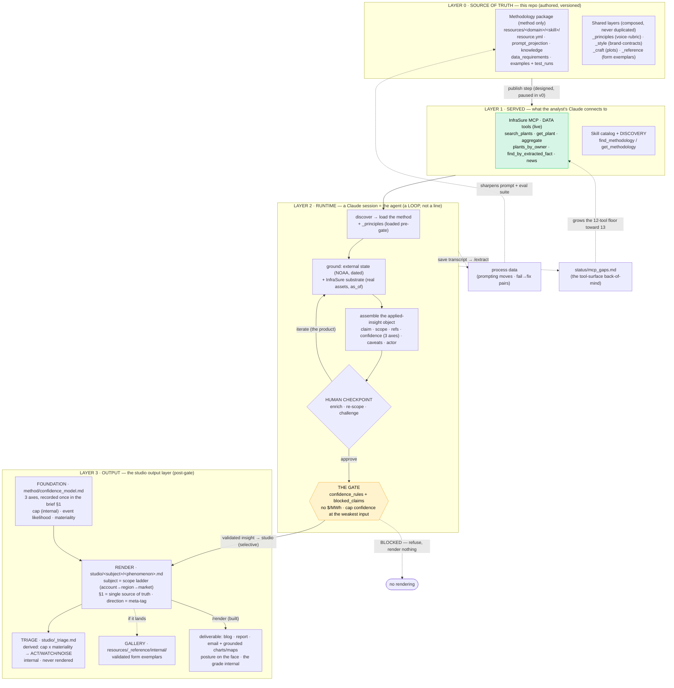

# Architecture — InfraSure Insights, End to End

> **Status**: the front door, 2026-06-13 · **amended 2026-06-14** (climate-&-weather-risk product framing, §1) · **amended 2026-06-15** (Layer 3 = the **studio output layer**: confidence foundation → render → triage → gallery; confidence as **three axes**; `/render` built — `plans/2026-06-15_output_layer_architecture.md`). The single intuitive map of the whole system — what it is, how it flows, and where every other doc fits. It **summarizes and points**; the deep docs own the detail.
>
> **Audience**: anyone new to the project (read this first); seniors vetting the direction; the model itself, for orientation.
>
> **Read next**: `principles.md` (what must not move), `method/` (how to reason & build), `process/` (the loop), `use_cases.md` (who it's for), `status/` (what's built / next).

## 1 · What This Is — The Second Surface (the moat)

**What InfraSure is** (the product this serves): a **climate & weather risk-analytics platform for energy infrastructure** — forward-looking, asset-specific hazard / exposure / resilience intelligence for owners · investors · lenders. Its spine is **(hazard × asset-class) + (weather × asset-class) + the commercial layer they resolve into** — e.g. *hail → a solar fleet's panels → a hail-insurance dollar claim*. It is an **intelligence system whose reasoning is evidence-disciplined**: the validation gate (§7) is its **firewall, not its purpose** — it keeps the intelligence from becoming fluent mush, it does not replace it.

InfraSure already has one surface: **data** — a curated US energy-infrastructure substrate (~15.5K plants, ~29.7K generators, ~9.8K queue projects, ~57K classified news articles) reachable through read-only MCP tools. That surface answers *"what is true."*

This project adds the **second surface: methodology** — packaged, discoverable reasoning that tells a model *how an InfraSure analyst reasons over the data*: what to retrieve, how to reason, what **not** to claim, how to score confidence. That surface answers *"how to reason."*

```text
   axis 1 · DATA            "what is true"      search_plants · get_plant · aggregate     ✅ live
   axis 2 · METHODOLOGY     "how to reason"     el_nino_enso · (drought · wildfire …)     ◀ this repo
                 └──────────────┬──────────────────────────┘
                                ▼
        "here is the data, AND here is how an InfraSure analyst reasons over it"  =  THE MOAT
                                                          (a vanilla LLM copies neither curated axis)

   commentary  ✗  "El Niño may affect US electricity markets."
   insight     ✓  "El Niño Watch DJF 26-27 → wetter CA winter → downside to winter solar CF across the
                   CA ≥50MW fleet (Topaz 57695, Desert Sunlight 57993); owners Clearway/BHE + offtaker
                   PG&E should watch; a forward, directional read (calibration cap LOW, internal — one of
                   three axes, method/confidence_model.md); no $/MWh claim."
```

The moat is **grounding, not fluency** — the discipline that makes that second line possible is owned by `principles.md`; this doc shows where it sits in the system.

**Three pillars** (the project at the highest level): **Pillar 1 · MCP** (data tools, built) · **Pillar 2 · Reference/KB** (methodology + knowledge, built) · **Pillar 3 · the combined agent** (1 + 2 + agentic architecture — the open work). Pillars 1–2 are in *refine + validate*; Pillar 3's use-case shape is `use_cases.md`.

## 2 · The Flow, End to End

One picture of the whole system: source → served → runtime loop → output, plus the two feedback loops that grow it.



**Layer 3 is the studio output layer** (`../studio/README.md`): a confidence **foundation** (`method/confidence_model.md` — the three axes recorded once in a brief's §1), a subject-keyed **render layer** (`studio/<subject>/<phenomenon>.md`, where subject is a scope ladder account→region→market and `direction` top_down/bottom_up is a meta-tag, not a folder), an internal **triage board** (`studio/_triage.md`, cap x materiality → ACT/WATCH/NOISE, never rendered), and the **gallery** (`resources/_reference/internal/`). It renders to **blog · report · email** via **`/render`** — blog generic, report scoped to a portfolio/client/region, email a subset; the *form envelope* is owned by `resources/_style/output_contracts.md`. Origination is **studio-first for the artifact** (the insight is still gated upstream, P2) and **bottom_up before top_down**; on the rendered face, **posture not the cap grade** (`method/confidence_model.md` §3). This doc points; `studio/README.md` owns the output-layer architecture.

## 3 · The Four Layers (the stack)

```text
LAYER 0  SOURCE     this repo — authored, reviewed, versioned methodology
   │                  packages (method only) + shared layers (_principles · _style · _craft · _reference)
   ▼  publish (repo is SOURCE, not the served thing — §5)
LAYER 1  SERVED     InfraSure MCP DATA tools (live)  +  skill catalog + discovery (find/get_methodology)
   │                  the catalog grows by MORE packages, not fatter ones
   ▼
LAYER 2  RUNTIME    a Claude session = the agent: discover → ground → assemble → GATE
   │                  ▲___ human checkpoint (enrich · re-scope · challenge) ___│   (a LOOP — §4)
   ▼  validated insight object
LAYER 3  OUTPUT     the studio output layer (studio/): FOUNDATION (method/confidence_model.md, 3 axes
                      in the brief §1) + RENDER (studio/<subject>/<phenomenon>.md, §1 = single source of
                      truth; subject = scope ladder; direction = meta-tag) + TRIAGE (studio/_triage.md,
                      internal ACT/WATCH/NOISE) + GALLERY. Rendered to blog · report · email via /render
                      (built); posture on the face, the cap grade internal.
                      = renderings of a VALIDATED insight, never before the gate (principles.md P2)
```

**Layer 0 file anatomy** (one package = a small fixed set, each a different job):

```text
resources/<domain>/<skill>/
  resource.yml         SPEC   → taxonomy (discovery) · confidence_rules + blocked_claims (gates) · prompt sections
  prompt_projection.md METHOD → the instruction body the session loads
  knowledge.md         MECHANISM → cited domain reasoning (the stable "why")
  resource.md          human canon          data_requirements.md  retrieval plan / gaps
  examples/ + test_runs/  EVAL SUITE → golden output + pass/fail cases
```

`resource.yml` is the **load-bearing seam**: one file drives three things — **discovery** (taxonomy), **the served prompt** (which sections inject), and **the gates** (`confidence_rules` + `blocked_claims`). Keep the methodology layer stable and the execution layer swappable (`principles.md` P1) — that is how the project absorbs model advances without rebuilding.

## 4 · The Runtime Is a Loop, Not a Line

A one-shot draft is a draft. The enrichment that makes an insight useful happens across turns, and the human checkpoint in that loop is the product, not overhead (`principles.md` P4).

```text
   discover → ground → assemble → GATE → studio (selective) → /render
                 ▲                  │
                 └─ human checkpoint ┘
                    (enrich · re-scope · challenge · approve)

   the loop is "more hands, more dimension"; the eval suite must see the LOOP, not just the final draft
   post-gate, studio is a SELECTIVE amplification lane (most outputs take the baseline gated→/render path)
```

The full procedure is `process/test_protocol.md`; the loop is packaged as commands (`process/commands.md`).

## 5 · Repo Is Source, Not the Served Thing

You do **not** bolt the raw `resources/` folder onto MCP. The repo is **source of truth**; a **publish step** (designed, paused in v0) compiles each package into a served unit.

```text
unit of delivery   = ONE SKILL  (el_nino_enso)              ← what a session loads (token-economical)
unit of discovery  = the TAXONOMY (domain·family·drivers·actors)  ← how a session finds the right skill
shared layers      = composed at session time, never bundled into a package or served as folders
```

Loading one skill (not a whole domain) keeps context lean; skills and shared layers **compose** at runtime. A persona ("weather analyst") is a runtime composition, never a stored folder. The same is true of a styled output — it is a projection, not a source.

## 6 · Terminology — Package · Skill · Agent · Project · Tool

Easy to conflate; the glossary:

| Term | What it is | In our stack |
|---|---|---|
| **Package / methodology resource** | the folder of SOURCE files we author | the **authoring** unit, `resources/<domain>/<package>/` |
| **Skill** | the published, loadable capability compiled from a package (`SKILL.md` + bundled files) | the **served** unit: `package → publish → skill` |
| **Agent** | a running Claude session that loaded a skill + the MCP tools | the analyst session behaving as an "ENSO analyst" |
| **Claude Project** | a claude.ai workspace (instructions + attached files) | a v0 **manual-testing vehicle** — not the target delivery |
| **Tool** | a single callable function | the MCP data tools + `find_methodology` |

```text
PACKAGE (source, many files) ──publish──▶ SKILL (served) ──loaded by──▶ AGENT (a session) ──calls──▶ TOOLS
```

Naming: package/slug is `snake_case` (`el_nino_enso`); the published Skill `name` is `kebab-case` (`el-nino-enso`). Underscore-prefixed `resources/_*` folders are **shared layers, not packages** (the rule lives in `resources/README.md`). The discovery contract (find/get_methodology, ranking, the SkillIndexRecord) is owned by `method/discovery_spec.md`.

## 7 · The Validation Gate (the firewall)

Before anything renders, the applied-insight contract + `resource.yml` rules are the quality firewall:

```text
confidence_rules    → set the CALIBRATION CAP at the weakest input (ENSO default = LOW) — one of three axes,
                      event-likelihood + materiality the others; the cap grade is internal (method/confidence_model.md)
blocked_claims      → refuse exact LMP / plant-level forecasts / pre-validation outreach (the heaviest-lifting field)
input-availability  → empty asset scope or a stale external pull ⇒ BLOCKED
examples/+test_runs → the EVAL SUITE: a skill must reproduce its golden output before publish
```

The applied-insight object (`claim · scope · methodology_reference · source_refs · confidence · caveats · actor_relevance · review_trace`) is defined by `method/resource_standard.md`; the manual gate and its pass/fail criteria are `process/test_protocol.md`; the 5-criterion scoring layer on top of the binary gate is `resources/_principles/rubric.md`. **`confidence` is not one number** — it is three axes (calibration cap · event likelihood · materiality), and only posture renders while the cap grade stays internal: the model is `method/confidence_model.md`.

**v0 caveat — the gate is self-policing**: in v0 it is a prompt-level convention enforced by the same session that drafts. That is a known weakness; the fix is *independence* (a separate `/gate-check`, `process/commands.md`), not more self-review.

## 8 · Where Everything Lives

```text
WHY / WHAT        architecture.md (this doc)  ·  principles.md  ·  use_cases.md
HOW TO REASON     method/analysis_families.md · method/resource_standard.md · method/confidence_model.md (3-axis)
  & BUILD         method/data_map.md · method/discovery_spec.md
THE LOOP          process/test_protocol.md · process/commands.md
THE OUTPUT        studio/ (Layer 3: confidence foundation → render briefs → _triage board → gallery;
  LAYER           studio/README.md is its front door) · rendered via /render
WHAT'S BUILT      status/capabilities.md · status/mcp_gaps.md · status/commands.md
  / NEXT          plans/ (the active working plans)
FUNDAMENTALS      learning/ (onboarding: MCP basics · substrate · resources · prompt projection)
THE RESOURCES     resources/ (the packages + the shared layers; resources/README.md is their registry)
```

---

**See also**: `principles.md` (the discipline behind the moat), `method/` (the contract), `process/` (the loop), `use_cases.md` (the two buckets × audience), `status/capabilities.md` (build status + open decisions), `resources/README.md` (the package + shared-layer registry).
